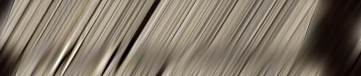

# Shearlet-Transform-TensorFlow

[](http://data.mip.informatik.uni-kiel.de:555/wwwadmin/Publica/2019/2019_Gao_Light%20Field%20Reconstruction%20Using%20Shearlet%20Transform%20in%20TensorFlow.pdf)
[](http://data.mip.informatik.uni-kiel.de:555/wwwadmin/Publica/Presentations/2019_Gao_ICME_Workshop.pdf) 
[](http://www.youtube.com/watch?v=5eQ-upVniYo "iterative sparse regularization") 
[](https://colab.research.google.com/drive/1oJgEMMykxhQJFSMqVfZvNj6CKOeAycaI?usp=sharing)  
This is an implementation of Shearlet Transform (ST) [1, 2] for light field reconstruction using ***TensorFlow 1***. If you find this code useful in your research, please consider citing [1, 2] and 
```
@inproceedings{gao2019light,
  title={Light field reconstruction using shearlet transform in tensorflow},
  author={Gao, Yuan and Koch, Reinhard and Bregovic, Robert and Gotchev, Atanas},
  booktitle={IEEE International Conference on Multimedia \& Expo Workshops (ICMEW)},
  pages={612--612},
  year={2019},
}
```
This code was tested on an Ubuntu 18.04 system using Tensorflow 1.15.4 and an NVIDIA GeForce RTX 2080 Ti GPU. 

News:
- [2021/09/05] Demo with Google Colab implemented in TF2 is available.

## Introduction ##
ST is designed for reconstructing a Densely-Sampled Light Field (DSLF) from a Sparsely-Sampled
Light Field (SSLF). It typically consists of pre-shearing, shearlet system construction, sparse regularization and post-shearing. This TensorFlow implementation of ST focuses on sparse regularization, which is composed of analysis transform, hard thresholding, synthesis transform and double overrelaxation. A dataflow graph of these four components are illustrated as below:  


## Getting started ##
### Python requirements ###
``` bash
$ git clone --recurse-submodules https://github.com/ygaostu/Shearlet-Transform-TensorFlow.git
$ cd Shearlet-Transform-TensorFlow
$ docker build -t tf1:1.0 .
```
### Prepare datasets ###
Prepare the pre-sheared sparsely-sampled Epipolar-Plane Images (EPIs) and masks. Put them into folders like
```
./data/ssepi/dishes_r5
```
and name them like
```
0001_rgb.png, 0002_rgb.png, ...
0001_mask.png, 0002_mask.png, ...
```

For example, "0458_rgb.png" and "0458_mask.png" are presented as follows:

  


Note that the pre-shearing process has already been performed in the above images. The sampling interval is 16 pixels and the maximum disparity range is also 16 pixels. Therefore, we choose to use a shearlet system with 4 scales to perform the EPI reconstruction as below:

### Sparse Regularization ### 
``` bash
$ docker run --gpus all --env CUDA_VISIBLE_DEVICES=0 -v $PWD:/data -w /data --user $(id -u):$(id -g) -it --rm tf1:1.0 \
  python validate.py --validate_path=./data/ssepi/ --save_path=./data/rec_dsepi --batch_size=4 --tensorboard_path=./tensorboard --shearlet_system_path=./model/shearlet_systems/st_127_127_4.mat
```
The reconstructed EPI corresponding to "0458_rgb.png" is presented as follows:



Note that the shearlet system for the pre-sheared sparsely-sampled EPIs should be prepared in advance. It is placed in the folder "./model/shearlet_systems" by default. How to generate a specially-tailored shearlet system can be found in this [GitHub repository](https://github.com/ygaostu/shearlets).

### Visualization ###
The visualization of the pipline of ST is performed using TensorBoard:
``` bash
$ tensorboard --logdir=./tensorboard
```
Then visit `http://localhost:6006`. The dataflow graph is like


Intermediate results are like


## Reference ##
> [1] S. Vagharshakyan, R. Bregovic, and A. Gotchev, “Light field reconstruction using shearlet transform,” IEEE TPAMI, vol. 40, no. 1, pp. 133–147, 2018.  
> [2] S. Vagharshakyan, R. Bregovic, and A. Gotchev, “Accelerated shearlet-domain light field reconstruction,” IEEE JSTSP, vol. 11, no. 7, pp. 1082–1091, 2017.
